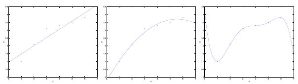

原文：http://cs229.stanford.edu/notes/cs229-notes4.pdf  
翻译：[MIL Learning Group](https://github.com/milLearningGroup/Stanford-CS229-CN) - [Murray0575](https://github.com/Murray0575)  

# Part VI Learning Theory

## 1 Bias/variance tradeoff(权衡偏差与方差）
当我们在上线性回归，曾讨论过这样的问题：在数据拟合的时候，我们是选一个相对简单的模型，如线性的“$y=\theta_0+\theta_1x$",还是选择相对复杂的模型，如多项式“$y=\theta_0+\theta_1x+\cdots\theta_5x^5$".我们来看下面的例子：

如最右端的图所示，要用一个5次多项式来拟合数据，我们所得到的并不是一个好的模型。即使这个5次多项式在训练集合中通过$x$（比如说住房面积）能预测出一个非常好的$y$（比如说住房的价格）,但我们并不能知道这个模型能在训练集合外能给出一个好的房价预测。也就是说，这个在训练集合中得出来的好的5次多项式模型并不一定能很好地推广到训练集合外的房子上。一个**假设**（hypothesis）的**泛化误差**（generalization error,稍后将给出正式的定义）是它在所有实例而不一定是训练集合中所得到的**期望方差**（expected error）。

上图中最左边的线性拟合模型与最右边的5次多项式模型都有非常大的泛化误差。但是这两个模型所面临的问题是截然不同的。如果$y$与$x$之间的关系不是线性的，那么即使我们对一大堆训练数据进行线性拟合，所得到的线性模型仍然不能准确捕捉到数据内在的结构。我们现在粗略地将一个模型的**偏差**（bias）定义为期望的泛化误差，即使我们去拟合一个非常大（甚至无限）的训练集合。因此，对于上述问题，这个线性模型具有非常大的偏差，可能是对数据的欠拟合（也就是没有捕捉到数据所体现的结构特征）。

除了偏差，这里还有一个因素构成泛化误差，也就是模型拟合过程中的方差。例如，最右幅图中我们用5次多项式进行拟合就有很大的风险，因为很可能我们拟合的模型碰巧符合我们小规模、有限的训练集合，而并不能反映$x$和$y$之间更广泛的关系。这可能是因为我们只是碰巧有一个比平均房价稍贵的房子，或者是一个比平均房价稍便宜的房子等等。通过拟合这些偶然出现在训练集合中，并不能反映真实情况的伪模式（spurious patterns），我们可能得到一个具有很大的泛化误差的模型。在这种情况下，我们说这个模型有很大的方差$^1$。

通常情况下，偏差与方差之间存在一种权衡。如果我们的模型过于“简单”而且参数又少，那么这个模型可能有很大的偏差（但是方差很小）;如果这个模型太“复杂”，而且有很多的参数，那么可能会有很大的方差（但是有较小的偏差）;在上面的例子中，中间的2次多项式就比线性和5次多项式这两个极端要好。

>$^1$在讲义里，我们不试图给出关于偏差与方差的正式定义。当然，偏差与方差都有直接给出的正式定义，例如在线性回归里。对于两者的定义，有很多不同的提议，至今对哪个是正确或最权威的仍有争议。

## 2 Preliminaries

## 3 The case of finite H

## 4 The case of infinite H